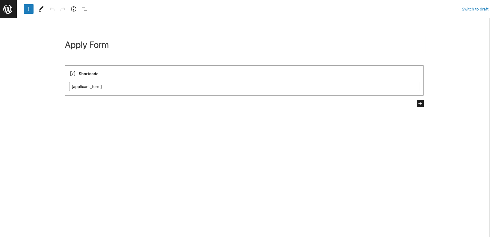
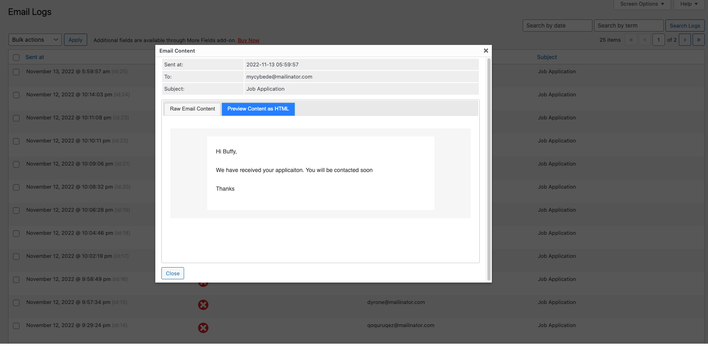
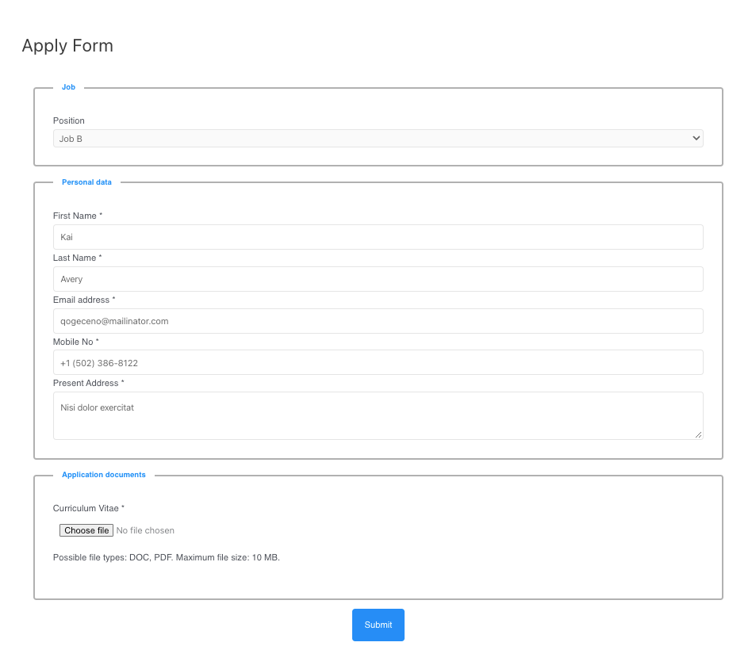
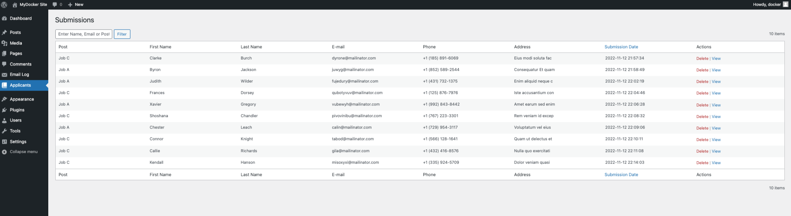
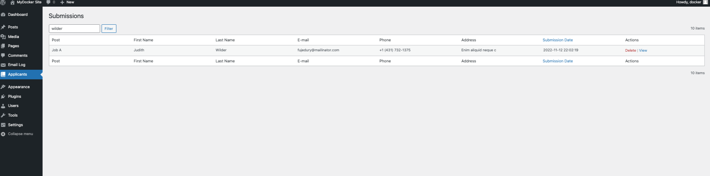
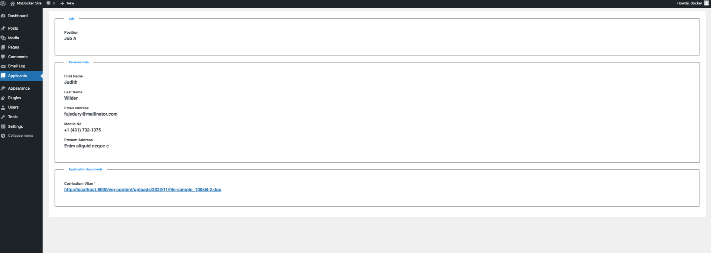
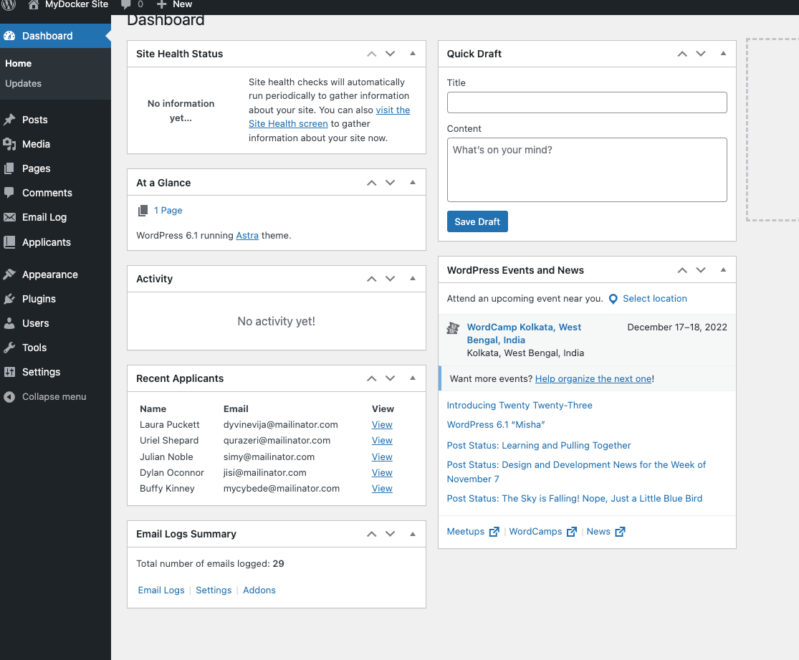

# Applicant Form 

A custom WordPress Plugin to create an Applicant Form

## Installation

Copy the plugin files to your WordPress plugin directory. Then install and activate the plugin from WordPress admin.

If you cloned the repo from GitHub. You can run these composer commands to make sure class files are loaded properly.
```bash
composer install
composer dump-autoload
```

## Usage

### Shortcode
Create a new page and add the shortcode [applicant_form]. Save the page.



When Submitted the form entries will be stored in the database and an email will be sent to the applicant.



### Frontend

On the page, you should see the following form.
 


### List

From the WordPress admin menu go to Applicants and you should see the list of submissions.
 


### Search and Sort

You can search the submission by keywords and sort the list by Submission Date.
 


### Action

You can view a submission entry by clicking on View and delete the submission by clicking on Delete.
 


### Widget

You can view the latest 5 submissions from the admin dashboard. 
 


